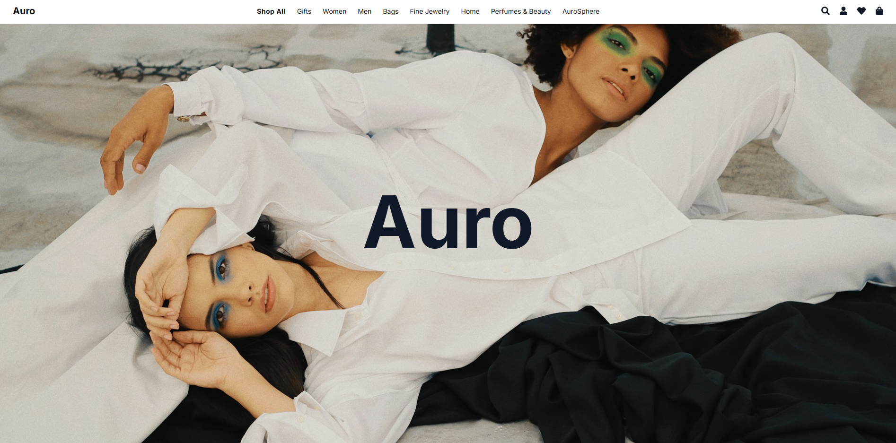

# 🛍️ Auro — Luxury Fashion E-Commerce (React + Vite)

This is a portfolio project inspired by modern luxury fashion brands (Prada, Acne Studios, Celine).
The goal is to build a minimalist and luxurious shopping experience with React, modern CSS, and smooth UX animations.

## 🚀 Tech Stack

React 18 (with Vite) — fast SPA framework

React Router v6 — routing between pages (Home, Shop, Cart, Store Locator, News)

Context API — shopping cart state management

Framer Motion — animations & transitions (hero, pop-ups)

Leaflet — interactive map for Store Locator

React Country Flag — international shipping selector with flags

CSS — mostly custom component-based CSS files (classic styling for easier maintainability)

TailwindCSS — partially used for rapid prototyping & utilities (spacing, flex/grid, colors)

Vercel (planned) — deployment

## ✨ Features

Header & Navigation

Sticky top header with brand name “Auro” (clickable → Home)

Centered navigation links (Shop, Women, Men, Bags, Jewelry, News, etc.)

Right-side icons: Search, Account, Wishlist, Cart

Pop-ups for Account, Wishlist, Cart (luxury style overlays)

Front Page

Large full-screen hero images (Acne Studios–style scrolling animation)

Overlay logo animation

Campaign & intro sections

News grid with latest brand updates

Newsletter subscription form

Footer

Four columns: links + social media icons

Store Locator link

Shipping info selector (with flags)

Disclaimer line at the bottom

Store Locator

Interactive map using Leaflet with custom luxury markers

Search bar with filtering by city

Predefined stores in Paris, London, New York, Copenhagen, Tallinn

Auto-zoom to store locations

Cart

Context-based cart system

Real-time item count in header

Ability to add/remove products

## 📌 Work in Progress

Improve Home page animations (logo smooth transition from center → last image bottom)

Build mega menu for Shop categories (hover dropdowns, Prada-style)

Add responsive mobile navigation

Enhance Wishlist functionality (currently placeholder pop-up)

Deploy to Vercel with proper SPA routing config

## 🎯 Goal

To demonstrate modern frontend development skills with React and strong UI/UX design inspired by luxury brands.
This project is part of The Odin Project
 React curriculum.

## 🖼️ Preview



## 🧑‍💻 Setup
```bash
# Install dependencies
npm install

# Start dev server
npm run dev

# Build for production
npm run build