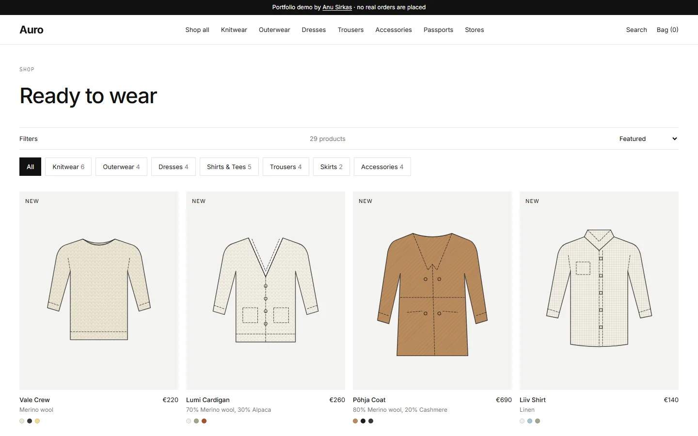
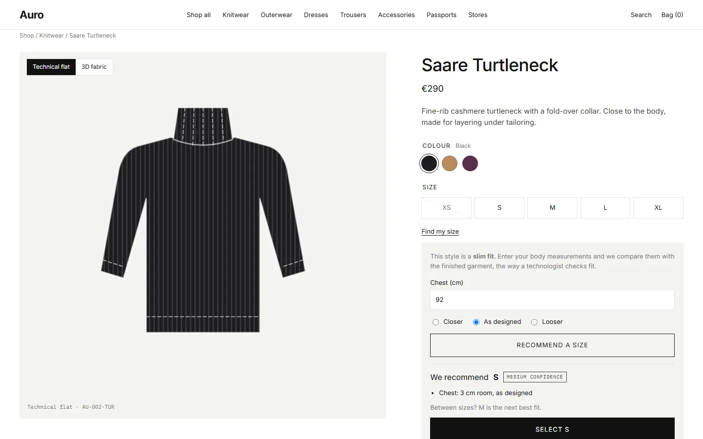
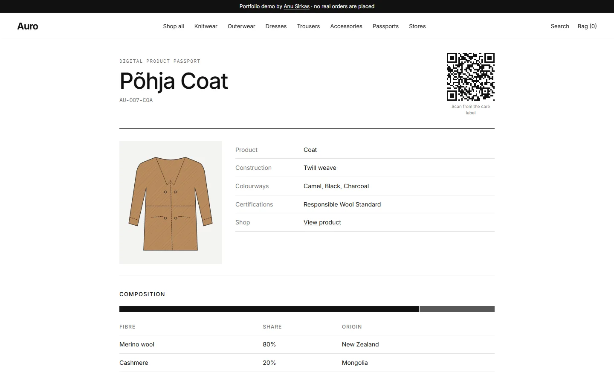
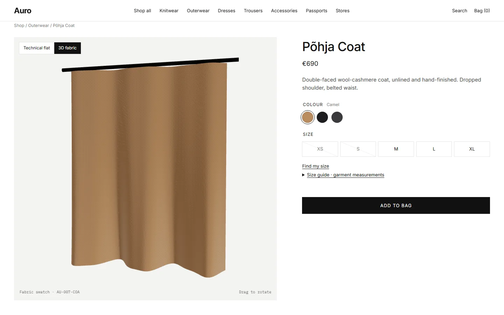
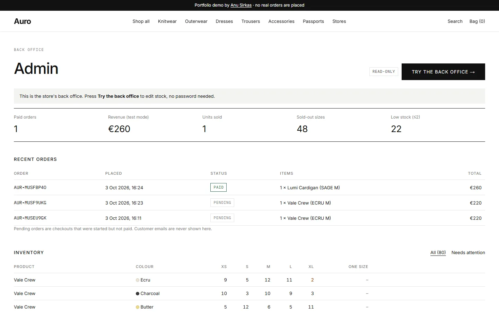
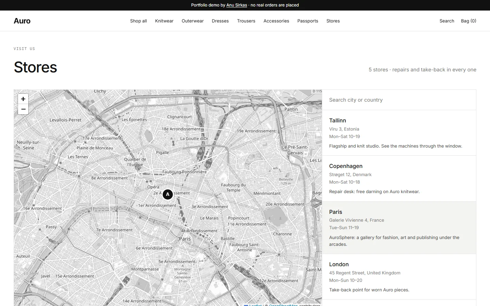

# Auro

A full-stack fashion store built as a portfolio project by [Anu Sirkas](https://portfolio-anu-sirkas-projects.vercel.app), a software engineer with ten years in garment technology and textile design.

**Live demo:** https://auro-studio.vercel.app · payments run in Stripe test mode, use card `4242 4242 4242 4242`



Auro started as a React storefront inspired by Acne Studios, Prada and Celine. It is now a Next.js application that treats fashion domain knowledge as product features:

- **Digital product passports.** Every product has a passport with fibre composition and origin, each step of its supply chain, certifications, care, repair and end-of-life guidance, plus an illustrative footprint. A QR code links each passport, as it would from a care label. The EU is phasing in digital product passports for textiles, so this is a real direction for fashion e-commerce.
- **A measurement-based fit finder.** It recommends a size by comparing body measurements with the garment's finished measurements and its designed *ease* (how much room a relaxed or slim fit is meant to have), allowing stretch knits to go below zero ease and rigid wovens not. That's how a garment technologist checks a fit sample.
- **A 3D fabric view.** Next to each technical flat, a React Three Fiber swatch hangs from a rail and drapes into folds. Its yarn texture is generated per construction (stockinette loops, rib, twill diagonals, over-under weave, satin floats, canvas), wool gets a soft sheen, and the colour follows the selected colourway. It loads only when opened, so the product page stays light.
- **Technical flats instead of product photos.** Products are drawn as the line drawings sent to factories (15 silhouettes in SVG), recoloured per colourway, with fabric texture by construction: knit, rib, twill, plain weave, satin or canvas.

## Screens

| Fit finder | Product passport |
|---|---|
|  |  |
| **3D fabric view** | **Admin** |
|  |  |
| **Front page** | **Stores** |
|  |  |

Screenshots are generated from the live site with `npx tsx scripts/screenshots.ts`.

## Stack

| | |
|---|---|
| App | Next.js 16 (App Router, Server Components, Server Actions), React 19, TypeScript |
| 3D | three.js with React Three Fiber, procedural canvas textures |
| Data | PostgreSQL on Neon, Drizzle ORM. Falls back to the bundled seed catalogue when no database is configured, so the demo never goes down |
| Payments | Stripe Checkout in test mode; a signed webhook marks orders paid and decrements stock (verified end to end on the live site) |
| Maps | Leaflet with OpenStreetMap tiles |
| Quality | Vitest unit tests, Playwright end-to-end tests (desktop and mobile), ESLint, type-checking and a production build on every push (GitHub Actions) |
| Hosting | Vercel |

Everything runs on free tiers.

## Admin

`/admin` shows paid and pending orders, test-mode revenue, units sold and the full inventory grid with sold-out and low-stock sizes highlighted. Anyone can view it as a read-only demo (customer emails are never shown). Editing stock requires the `ADMIN_PASSWORD` set on the server: signing in sets a signed, http-only cookie, and stock is saved through Server Actions that re-check the session.

## Engineering notes

- **Faceted search with shareable URLs.** All filter state (category, size, colour, fibre, price, stock, sort) lives in the URL. Each facet is counted with every filter applied *except its own*, so options don't vanish while you choose. See `src/lib/catalogue-query.ts`.
- **The server never trusts the bag.** Checkout re-prices every line from the catalogue and re-checks stock (`src/lib/checkout.ts`). If stock changed while an item sat in the bag, the API returns what is available and the bag corrects itself.
- **Race-safe stock.** The webhook decrements stock with `UPDATE … WHERE stock >= quantity` and ignores duplicate deliveries, so two buyers can't oversell the last item.
- **Browsing survives a database blip.** If Neon is cold or unreachable, catalogue pages fall back to the bundled data and log the error. Checkout reads live stock separately and returns 503 rather than trusting the fallback.
- **Small catalogue, deliberate trade-off.** ~30 products load in one relational query and are filtered in memory. At a few thousand SKUs, filtering would move into SQL with indexes on category, fibre and colour.
- **Cart without hydration mismatches.** The bag is a tiny external store over `localStorage` read through `useSyncExternalStore`, synced across tabs.

## Data model

`products` → `colorways`, `variants` (SKU × colourway × size, with stock) and one `passports` row → `passport_fibres`, `supply_stages`. `orders` store priced lines as JSON. Schema: `src/lib/db/schema.ts`.

## Run locally

```bash
npm install
npm run dev
```

The store works without any configuration. To use a real database and payments, copy `.env.example` to `.env.local` and add:

```bash
DATABASE_URL=...            # Neon connection string
STRIPE_SECRET_KEY=sk_test_...
STRIPE_WEBHOOK_SECRET=whsec_...
ADMIN_PASSWORD=...          # optional, enables stock editing in /admin
```

then create and fill the tables:

```bash
npm run db:push
npm run db:seed
```

## Tests

```bash
npm test           # unit tests (Vitest)
npm run test:e2e   # end-to-end tests (Playwright)
```

**Unit tests** cover catalogue querying and faceting, the fit-finder algorithm and server-side checkout validation.

**End-to-end tests** build the app and drive it in Chromium: URL-driven filters and shareable views, search, the fit finder selecting a size, the bag (add, change quantity, survive a reload, remove), the 3D fabric view loading on demand, checkout API validation, the webhook rejecting unsigned calls, passports, store search, the read-only admin and the mobile menu. They run with database and Stripe keys blanked, so they never touch real services and always see the same catalogue.

---

Auro is a fictional brand. Footprint figures are illustrative estimates, not audited data. Editorial photography from the original Auro project.
